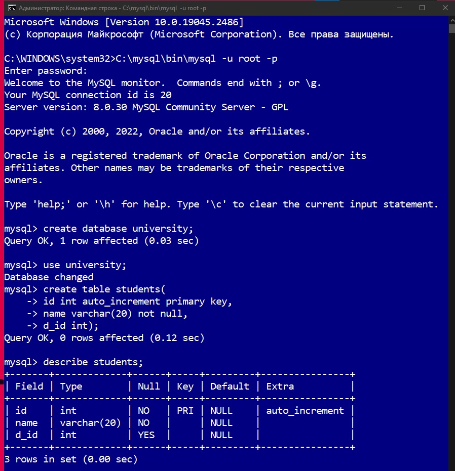

<p align = "center">МИНИСТЕРСТВО НАУКИ И ВЫСШЕГО ОБРАЗОВАНИЯ<br>
РОССИЙСКОЙ ФЕДЕРАЦИИ<br>
ФЕДЕРАЛЬНОЕ ГОСУДАРСТВЕННОЕ БЮДЖЕТНОЕ<br>
ОБРАЗОВАТЕЛЬНОЕ УЧРЕЖДЕНИЕ ВЫСШЕГО ОБРАЗОВАНИЯ<br>
«САХАЛИНСКИЙ ГОСУДАРСТВЕННЫЙ УНИВЕРСИТЕТ»</p>
<br><br><br><br><br><br>
<p align = "center">Институт естественных наук и техносферной безопасности<br>Кафедра информатики<br>Григораш Алексей Владимирович</p>
<br><br><br>
<p align = "center">Лабораторная работа № 10<br>«<strong>Базы данных</strong>»<br>01.03.02 Прикладная математика и информатика</p>
<br><br><br><br><br><br><br><br><br><br><br><br>
<p align = "right">Научный руководитель<br>
Соболев Евгений Игоревич</p>
<br><br><br>
<p align = "center">г. Южно-Сахалинск<br>2022 г.</p>
<br><br><br><br><br><br><br><br>

## Введение

MySQL - это популярный сервер баз данных, используемый в разных приложениях. SQL означает язык структурированных запросов - (S)tructured (Q)uery (L)anguage, который MySQL использует для коммуникации с другими программами. Сверх того, MySQL имеет свои собственные расширенные функции SQL для того чтобы обеспечить пользователям дополнительный функционал.

## Задачи:
1. Создать базу данных «university»

2. В базе данных «university» создать таблицу «students» с полями:
id тип int – ключ (PK), счетчик (AI);name тип varchar, ненулевое (NN);d_id тип int.

3. Заполнить таблицу «students» произвольными записями - 5 строк (поле id следует заполнять нулями).

4. Сохранить созданную в программе-дизайнере схему базы данных на локальный компьютер.


6. Подключиться к базе данных MySQL (команда mysql –u root –p).

7. Активизировать базу данных «university» (команда use).

8. Выполнить SQL команду: SELECT * FROM students; результаты записать в отчет.

9. Выполнить SQL команды:
```sql
    UPDATE students SET name = ‘Ivan’ WHERE id = 2;
    SELECT * FROM students WHERE id = 2; результаты записать в отчет.
```
10. Выполнить SQL команды:
```sql
    DELETE FROM students WHERE id = 2;
    SELECT * FROM students; результаты записать в отчет.
```
11. Проанализировать полученные результаты.


## Решение:



## Вывод:
В ходе выполнения задач повторил работу с MySQL.